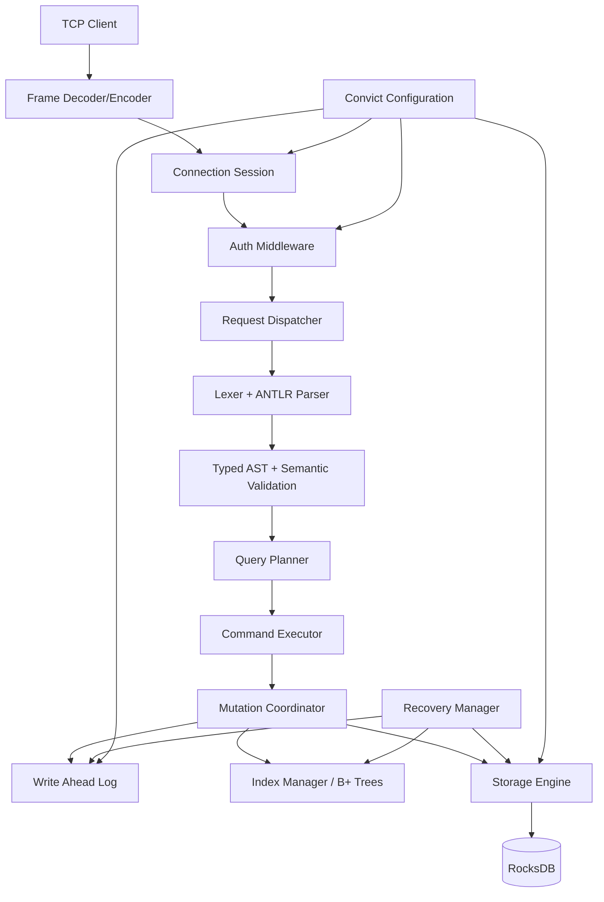
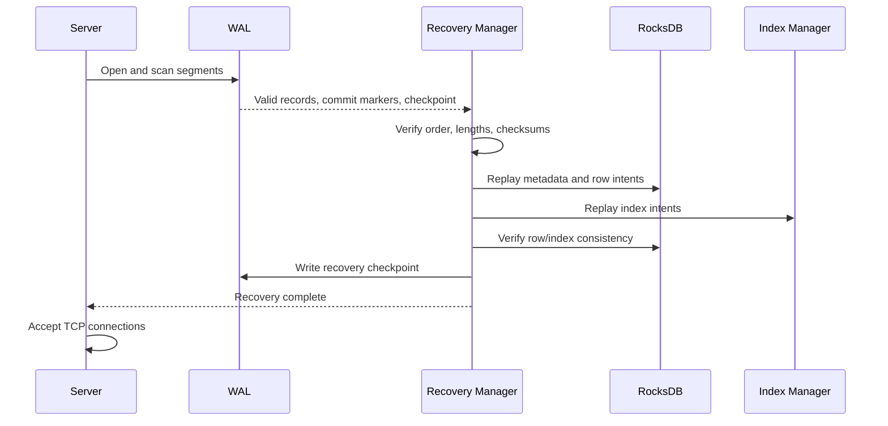
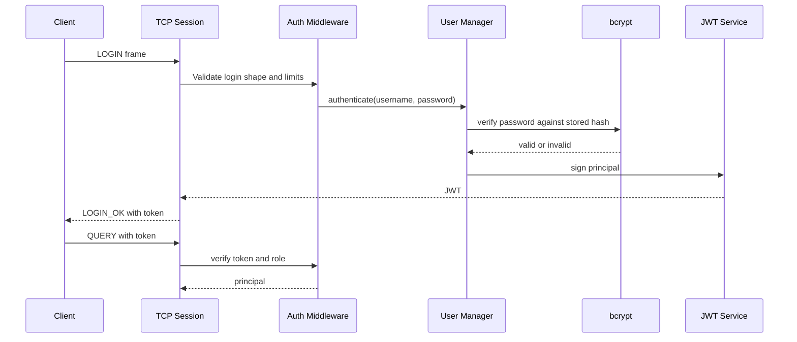
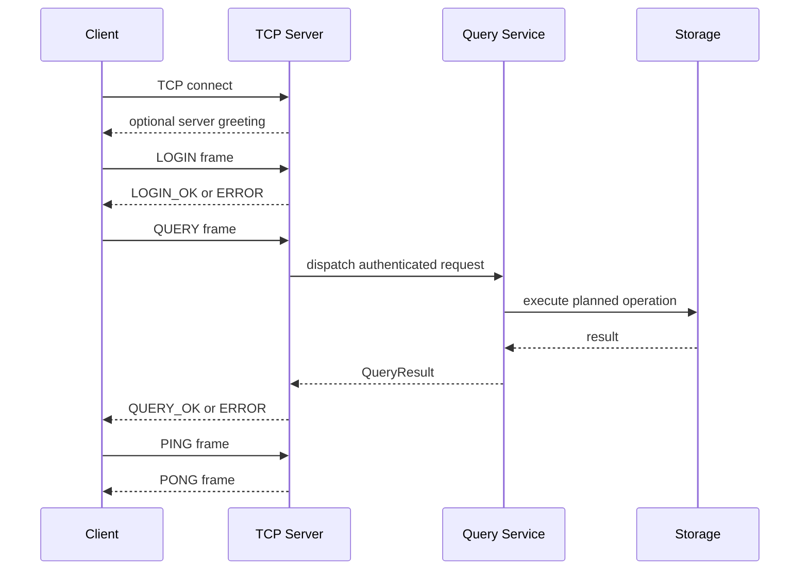
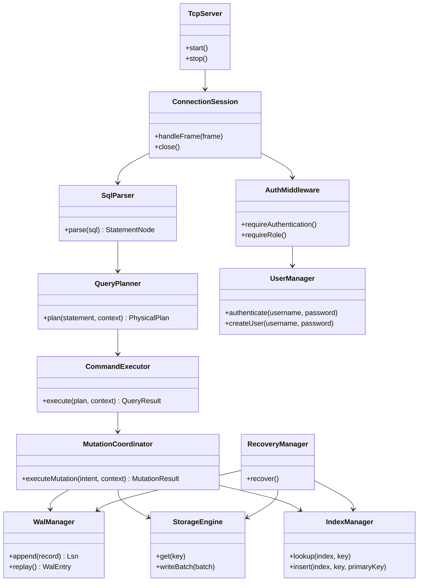

# MyQ Database Server

## Phase 1 Architecture and Implementation Specification

**Status:** Implemented Phase 1 baseline  
**Version:** 0.3.2  
**Date:** 2026-09-18  
**Runtime:** Node.js  
**Language:** TypeScript  
**Primary transport:** Native TCP (`node:net`)  
**Storage:** RocksDB through a Node.js binding  
**Target compatibility:** MySQL-inspired SQL behavior, not wire-compatible MySQL in Phase 1

## Table of contents

- [1. Objective](#1-objective)
  - [1.1 Supported SQL](#11-supported-sql)
  - [1.2 Phase 1 correctness guarantees](#12-phase-1-correctness-guarantees)
- [2. Architecture](#2-architecture)
  - [2.1 Layered architecture](#21-layered-architecture)
  - [2.2 Runtime process model](#22-runtime-process-model)
  - [2.3 Dependency direction](#23-dependency-direction)
- [3. Monorepo and folder structure](#3-monorepo-and-folder-structure)
  - [3.1 Package structure](#31-package-structure)
- [4. Domain and data models](#4-domain-and-data-models)
- [5. SQL parser and AST](#5-sql-parser-and-ast)
- [6. Query planning and execution](#6-query-planning-and-execution)
- [7. RocksDB storage engine](#7-rocksdb-storage-engine)
- [8. B+ tree index manager](#8-b-tree-index-manager)
- [9. WAL and crash recovery](#9-wal-and-crash-recovery)
- [10. Transactions and concurrency](#10-transactions-and-concurrency)
- [11. Authentication and authorization](#11-authentication-and-authorization)
- [12. TCP protocol](#12-tcp-protocol)
- [13. Unified errors](#13-unified-errors)
- [14. Configuration](#14-configuration)
- [15. Public API contracts](#15-public-api-contracts)
- [16. Class relationships](#16-class-relationships)
- [17. Testing strategy](#17-testing-strategy)
- [18. Security and operational requirements](#18-security-and-operational-requirements)
- [19. Development roadmap](#19-development-roadmap)
- [20. Future extension strategy](#20-future-extension-strategy)
- [21. Production coding standards](#21-production-coding-standards)
- [22. Definition of done for Phase 1](#22-definition-of-done-for-phase-1)
- [23. Changelog](#23-changelog)

---

## 1. Objective

MyQ is a transactional, MySQL-inspired database server implemented in TypeScript. The system is designed as a real database engine with explicit parser, planner, executor, storage, indexing, durability, authentication, and networking boundaries. It is not a SQL facade over a key-value store.

Phase 1 delivers a reliable single-node database with:

- SQL parsing into a typed abstract syntax tree.
- Schema and metadata management.
- CRUD operations for tables and rows.
- Primary-key and unique secondary indexes.
- Write-ahead logging before durable data mutation.
- Startup recovery after process or machine failure.
- Authenticated TCP sessions using bcrypt and JWT.
- A versioned framed TCP protocol.
- Tests for correctness, durability, security, and protocol behavior.

Phase 1 explicitly does not deliver replication, sharding, query optimization, caching, clustering, MVCC, observability integrations, or a MySQL-compatible client wire protocol. Interfaces are designed so those capabilities can be added without replacing the core storage and execution contracts.

### 1.1 Supported SQL

```sql
CREATE DATABASE database_name;
CREATE TABLE table_name (
    id INT PRIMARY KEY,
    name VARCHAR(255) NOT NULL,
    email VARCHAR(255) UNIQUE
);
DROP TABLE table_name;
INSERT INTO table_name VALUES (1, 'Soumya', 's@example.com');
INSERT INTO table_name (id, name) VALUES (2, 'Roy');
UPDATE table_name SET name = 'Roy' WHERE id = 1;
DELETE FROM table_name WHERE id = 1;
SELECT * FROM table_name;
SELECT id, name FROM table_name WHERE id = 1 ORDER BY id ASC LIMIT 10;
```

Authentication administration additionally supports:

```sql
CREATE USER 'admin' IDENTIFIED BY 'secret';
ALTER USER 'admin' IDENTIFIED BY 'new-secret';
DROP USER 'admin';
```

### 1.2 Phase 1 correctness guarantees

1. A committed mutation has a durable WAL record before its storage mutation is acknowledged.
2. WAL records are binary length-delimited frames with SHA-256-derived checksums so torn or corrupted tails are detectable.
3. Startup recovery verifies frames, replays committed row mutations idempotently, and reports an actionable error for invalid records.
4. Primary-key and unique constraints are enforced before a mutation becomes visible.
5. A single server process serializes writes per database to provide deterministic Phase 1 behavior.
6. Authentication secrets are never stored or logged in plaintext.
7. Every request receives one structured response or a structured protocol error.

Phase 1 does not claim full ACID transactions across multiple statements. The unit of durability is one command mutation. A future transaction manager can extend the same WAL and storage interfaces.

### 1.3 Implementation status

| Capability | Status in `0.3.2` | Notes |
|---|---|---|
| SQL tokenizer and typed AST | Implemented | Self-contained TypeScript parser; ANTLR grammar is retained as the canonical grammar artifact. |
| CRUD, filtering, ordering, limits | Implemented | Rule-based execution over the portable storage adapter. |
| Primary and unique constraints | Implemented | Preflight validation prevents partial multi-row inserts. |
| Serialized mutations | Implemented | Process-level write queue; no multi-statement transactions. |
| WAL framing, checksums, replay | Implemented | New frames are checksummed; legacy JSONL is read for migration. |
| TCP authentication and framing | Implemented | JWT, bcrypt, `MYQ1` framed JSON protocol. |
| Portable durable storage | Implemented | Atomic file replacement adapter. |
| Native RocksDB backend | Planned | `StorageEngine` is the replacement boundary. |
| Persisted B+ tree pages | Planned | Current index manager is an ordered in-memory index rebuilt on startup. |
| Cost-based planner and MVCC | Planned | Phase 2 capabilities. |

---

## 2. Architecture

### 2.1 Layered architecture



### 2.2 Runtime process model

The Phase 1 server is one Node.js process with these logical services:

- `TcpServer`: accepts sockets, applies limits, and creates sessions.
- `ConnectionSession`: owns framing, authentication state, request ordering, and heartbeat state.
- `QueryService`: parses, plans, executes, and formats results.
- `MutationCoordinator`: orders WAL, index, and row-store work.
- `StorageEngine`: owns RocksDB handles and keyspaces.
- `IndexManager`: owns table index definitions and B+ tree persistence.
- `RecoveryManager`: runs before accepting client traffic.
- `UserManager`: manages the internal authentication catalog.
- `ConfigProvider`: validates configuration once at startup.

No module may reach directly into another module's private RocksDB handles. All access crosses an interface boundary.

### 2.3 Dependency direction

```text
network -> auth, query
query -> parser, planner, executor
executor -> transactions, storage, indexes
transactions -> wal, storage, indexes
storage -> rocksdb binding
indexes -> storage key/value primitives
all modules -> shared, config
```

Dependencies point inward toward contracts and domain types. Infrastructure adapters implement interfaces defined by the owning domain module.

---

## 3. Monorepo and folder structure

```text
myq/
├── package.json
├── package-lock.json
├── tsconfig.json
├── jest.config.ts
├── eslint.config.js
├── .env.example
├── Readme.md
├── documentation.md
├── src/
│   ├── main.ts
│   ├── app.ts
│   ├── shared/
│   │   ├── errors/
│   │   │   ├── MyQError.ts
│   │   │   ├── ErrorCode.ts
│   │   │   └── errorFactory.ts
│   │   ├── types/
│   │   │   ├── ids.ts
│   │   │   ├── values.ts
│   │   │   └── result.ts
│   │   ├── serialization/
│   │   ├── logging/
│   │   └── guards/
│   ├── config/
│   │   ├── schema.ts
│   │   ├── ConfigProvider.ts
│   │   └── defaults.ts
│   ├── parser/
│   │   ├── grammar/
│   │   │   ├── MyQLexer.g4
│   │   │   └── MyQParser.g4
│   │   ├── generated/
│   │   ├── ast/
│   │   │   ├── AstNode.ts
│   │   │   ├── statements.ts
│   │   │   ├── expressions.ts
│   │   │   └── constraints.ts
│   │   ├── AstBuilderVisitor.ts
│   │   ├── SemanticValidator.ts
│   │   └── SqlParser.ts
│   ├── catalog/
│   │   ├── CatalogService.ts
│   │   ├── MetadataRepository.ts
│   │   └── models.ts
│   ├── planner/
│   │   ├── LogicalPlan.ts
│   │   ├── PhysicalPlan.ts
│   │   ├── QueryPlanner.ts
│   │   └── operators/
│   ├── executor/
│   │   ├── ExecutionContext.ts
│   │   ├── CommandExecutor.ts
│   │   ├── RowSource.ts
│   │   └── operators/
│   ├── storage/
│   │   ├── StorageEngine.ts
│   │   ├── RocksDbStorageEngine.ts
│   │   ├── Keyspace.ts
│   │   ├── RowCodec.ts
│   │   └── RocksDbAdapter.ts
│   ├── indexes/
│   │   ├── BPlusTree.ts
│   │   ├── BPlusTreeNode.ts
│   │   ├── LeafNode.ts
│   │   ├── InternalNode.ts
│   │   ├── IndexManager.ts
│   │   ├── IndexCodec.ts
│   │   └── KeyComparator.ts
│   ├── transactions/
│   │   ├── MutationCoordinator.ts
│   │   ├── TransactionContext.ts
│   │   └── CommitProtocol.ts
│   ├── wal/
│   │   ├── WalManager.ts
│   │   ├── WalCodec.ts
│   │   ├── RecoveryManager.ts
│   │   └── Checksum.ts
│   ├── auth/
│   │   ├── UserManager.ts
│   │   ├── PasswordService.ts
│   │   ├── JwtService.ts
│   │   ├── AuthMiddleware.ts
│   │   └── UserRepository.ts
│   ├── network/
│   │   ├── TcpServer.ts
│   │   ├── ConnectionSession.ts
│   │   ├── FrameCodec.ts
│   │   ├── RequestDispatcher.ts
│   │   └── ProtocolTypes.ts
│   └── testing/
│       ├── fixtures/
│       └── utilities/
├── tests/
│   ├── unit/
│   ├── integration/
│   ├── durability/
│   ├── protocol/
│   └── fixtures/
├── scripts/
│   ├── generate-parser.ts
│   └── check-wal.ts
└── docs/
    ├── adr/
    ├── protocol.md
    └── operations.md
```

### 3.1 Package structure

For Phase 1, keep one deployable package to simplify local development and atomic versioning. Preserve package boundaries in source folders. Extract workspace packages only when independent release cadence or deployment requires it:

```text
packages/
├── myq-core/       # AST, planner, execution contracts
├── myq-storage/    # RocksDB, WAL, indexes
├── myq-server/     # TCP server and auth
├── myq-client/     # Optional protocol client
└── myq-testkit/    # Shared test fixtures
```

Recommended dependencies:

- `antlr4ts` and the ANTLR TypeScript runtime.
- A maintained RocksDB Node.js binding selected during platform validation.
- `bcrypt` for password hashing.
- `jsonwebtoken` for JWT signing and verification.
- `convict` for typed configuration.
- `jest`, `ts-jest`, and `fast-check` for tests and property checks.
- `eslint`, `prettier`, and `typescript` for static quality.

Native RocksDB bindings must be pinned and tested on every supported Node.js and operating system combination. CI must build the native dependency from a clean environment.

---

## 4. Domain and data models

### 4.1 Scalar values

```typescript
export type SqlValue = null | boolean | number | string | Date | Buffer;
export type Row = Record<string, SqlValue>;
export type DatabaseName = string;
export type TableName = string;
export type ColumnName = string;
export type Lsn = bigint;
export type TransactionId = string;
```

Phase 1 supports `INT`, `VARCHAR(n)`, `BOOLEAN`, and `TIMESTAMP`. Values are validated at the executor boundary before encoding.

### 4.2 Catalog models

```typescript
export interface DatabaseDefinition {
  name: DatabaseName;
  createdAt: string;
}

export interface ColumnDefinition {
  name: ColumnName;
  dataType: 'INT' | 'VARCHAR' | 'BOOLEAN' | 'TIMESTAMP';
  length?: number;
  nullable: boolean;
  ordinal: number;
  defaultValue?: SqlValue;
}

export interface ConstraintDefinition {
  name: string;
  type: 'PRIMARY_KEY' | 'UNIQUE' | 'NOT_NULL';
  columns: ColumnName[];
}

export interface IndexDefinition {
  name: string;
  table: TableName;
  columns: ColumnName[];
  unique: boolean;
  clustered: boolean;
}

export interface TableDefinition {
  database: DatabaseName;
  name: TableName;
  columns: ColumnDefinition[];
  constraints: ConstraintDefinition[];
  indexes: IndexDefinition[];
  createdAt: string;
  schemaVersion: number;
}
```

### 4.3 Metadata keyspace

Metadata is namespaced and versioned to prevent collisions:

```text
meta/v1/database/{database}
meta/v1/table/{database}/{table}
meta/v1/index/{database}/{table}/{index}
meta/v1/user/{username}
meta/v1/catalog-version
```

Keys are encoded using length-prefixed UTF-8 components rather than ambiguous string concatenation. Metadata writes use the same mutation coordinator as data writes.

### 4.4 Row keyspace

```text
row/v1/{database}/{table}/{primary-key-encoded}
```

The primary key is encoded with a type-aware, order-preserving codec. A row cannot exist without a primary key in Phase 1; tables without a declared primary key receive a hidden generated row identifier only if that behavior is explicitly enabled in configuration. The default is to require a primary key for deterministic indexing.

Rows use a canonical binary envelope:

```typescript
export interface EncodedRow {
  schemaVersion: number;
  fields: Record<ColumnName, SqlValue>;
}
```

JSON is useful for debugging but is not the durable format: it is larger, has ambiguous numeric/date behavior, and does not preserve type metadata reliably. MessagePack is a reasonable interim format, but Phase 1 should use a versioned canonical binary codec with explicit type tags. A future format can be introduced by `schemaVersion` and migration tooling.

---

## 5. SQL parser and AST

### 5.1 Parser responsibilities

1. Tokenize SQL using the generated ANTLR lexer.
2. Parse syntax using the generated parser.
3. Convert parse-tree contexts into domain AST nodes using a visitor.
4. Normalize identifiers and literal forms without changing meaning.
5. Run semantic checks that do not require catalog access.
6. Return structured syntax errors with source positions.

Catalog-dependent checks, such as whether a table exists, belong to planning or execution because they require a snapshot of metadata.

### 5.2 AST interfaces

```typescript
export interface SourceSpan {
  startOffset: number;
  endOffset: number;
  line: number;
  column: number;
}

export interface AstNode {
  kind: string;
  span: SourceSpan;
}

export interface StatementNode extends AstNode {
  kind: 'CREATE_DATABASE' | 'CREATE_TABLE' | 'DROP_TABLE' | 'INSERT' |
    'UPDATE' | 'DELETE' | 'SELECT' | 'CREATE_USER' | 'ALTER_USER' | 'DROP_USER';
}

export interface IdentifierNode extends AstNode {
  kind: 'IDENTIFIER';
  name: string;
}

export interface LiteralNode extends AstNode {
  kind: 'LITERAL';
  value: SqlValue;
  literalType: 'NULL' | 'BOOLEAN' | 'INTEGER' | 'STRING' | 'TIMESTAMP';
}

export interface ColumnReferenceNode extends AstNode {
  kind: 'COLUMN_REFERENCE';
  table?: string;
  column: string;
}

export type ExpressionNode = LiteralNode | ColumnReferenceNode | BinaryExpressionNode;

export interface BinaryExpressionNode extends AstNode {
  kind: 'BINARY_EXPRESSION';
  operator: '=' | '<>' | '<' | '<=' | '>' | '>=' | 'AND' | 'OR';
  left: ExpressionNode;
  right: ExpressionNode;
}

export interface WhereClauseNode extends AstNode {
  kind: 'WHERE';
  expression: ExpressionNode;
}

export interface OrderByItemNode extends AstNode {
  expression: ColumnReferenceNode;
  direction: 'ASC' | 'DESC';
}

export interface CreateDatabaseNode extends StatementNode {
  kind: 'CREATE_DATABASE';
  database: string;
  ifNotExists: boolean;
}

export interface ColumnDefinitionNode extends AstNode {
  kind: 'COLUMN_DEFINITION';
  name: string;
  dataType: ColumnDefinition['dataType'];
  length?: number;
  constraints: Array<'PRIMARY_KEY' | 'UNIQUE' | 'NOT_NULL'>;
}

export interface CreateTableNode extends StatementNode {
  kind: 'CREATE_TABLE';
  table: string;
  columns: ColumnDefinitionNode[];
  ifNotExists: boolean;
}

export interface DropTableNode extends StatementNode {
  kind: 'DROP_TABLE';
  table: string;
  ifExists: boolean;
}

export interface InsertNode extends StatementNode {
  kind: 'INSERT';
  table: string;
  columns?: string[];
  values: LiteralNode[][];
}

export interface AssignmentNode extends AstNode {
  kind: 'ASSIGNMENT';
  column: string;
  value: ExpressionNode;
}

export interface UpdateNode extends StatementNode {
  kind: 'UPDATE';
  table: string;
  assignments: AssignmentNode[];
  where?: WhereClauseNode;
}

export interface DeleteNode extends StatementNode {
  kind: 'DELETE';
  table: string;
  where?: WhereClauseNode;
}

export interface SelectNode extends StatementNode {
  kind: 'SELECT';
  table: string;
  columns: Array<'*' | string>;
  where?: WhereClauseNode;
  orderBy: OrderByItemNode[];
  limit?: number;
}

export interface CreateUserNode extends StatementNode {
  kind: 'CREATE_USER';
  username: string;
  password: string;
}

export interface AlterUserNode extends StatementNode {
  kind: 'ALTER_USER';
  username: string;
  password: string;
}

export interface DropUserNode extends StatementNode {
  kind: 'DROP_USER';
  username: string;
}
```

### 5.3 Visitor pattern

```typescript
export interface AstVisitor<T> {
  visitCreateDatabase(node: CreateDatabaseNode): T;
  visitCreateTable(node: CreateTableNode): T;
  visitDropTable(node: DropTableNode): T;
  visitInsert(node: InsertNode): T;
  visitUpdate(node: UpdateNode): T;
  visitDelete(node: DeleteNode): T;
  visitSelect(node: SelectNode): T;
  visitCreateUser(node: CreateUserNode): T;
  visitAlterUser(node: AlterUserNode): T;
  visitDropUser(node: DropUserNode): T;
}

export interface SqlParser {
  parse(sql: string): StatementNode;
}
```

`AstBuilderVisitor` implements the ANTLR-generated visitor. It must not perform storage access. A second visitor can be used for AST normalization, and planner visitors can convert statements into logical plans.

### 5.4 Error recovery

The parser uses ANTLR's error listeners but converts errors into `ParserError` values. For server execution, fail the whole statement on syntax errors; do not attempt partial execution. Error output includes code, message, line, column, and a safe source excerpt. Password literals and other sensitive values are redacted before logging.

Recovery policy:

- Collect syntax errors until parsing completes.
- Return the first error as the primary failure and retain bounded diagnostics for debugging.
- Reject trailing tokens after a complete statement.
- Enforce maximum SQL length before invoking ANTLR.
- Never recover by guessing a mutation.

---

## 6. Query planning and execution

### 6.1 Contracts

```typescript
export interface ExecutionContext {
  requestId: string;
  database: DatabaseName;
  principal: Principal;
  transaction: TransactionContext;
  cancellation: AbortSignal;
}

export interface LogicalPlan {
  kind: string;
  children: LogicalPlan[];
}

export interface QueryResult {
  columns: string[];
  rows: Row[];
  affectedRows?: number;
  lastInsertId?: string;
}

export interface QueryPlanner {
  plan(statement: StatementNode, context: PlanningContext): Promise<PhysicalPlan>;
}

export interface CommandExecutor {
  execute(plan: PhysicalPlan, context: ExecutionContext): Promise<QueryResult>;
}
```

### 6.2 Initial physical operators

- `TableScanOperator`: scans row keys for a table.
- `IndexScanOperator`: looks up primary or unique index entries.
- `FilterOperator`: evaluates a supported predicate.
- `ProjectOperator`: selects output columns.
- `SortOperator`: sorts bounded result sets in memory.
- `LimitOperator`: stops after the requested row count.
- `InsertOperator`, `UpdateOperator`, and `DeleteOperator`: produce mutation intents.
- `CreateTableOperator`, `DropTableOperator`, and `CreateDatabaseOperator`: mutate catalog metadata.

The planner initially chooses an index scan for equality predicates on indexed columns and a table scan otherwise. It does not claim a cost-based optimizer. This rule-based planner is intentionally replaceable.

### 6.3 SELECT execution trace

For `SELECT * FROM users WHERE id = 1`:

1. `ConnectionSession` decodes a query packet and authenticates its JWT.
2. `RequestDispatcher` creates a request ID and selects the query service.
3. `SqlParser.parse` generates a `SelectNode` with table `users`, wildcard projection, and `id = 1` predicate.
4. `SemanticValidator` checks expression shape and literal compatibility.
5. `CatalogService` loads the current `users` definition and confirms `id` is a primary key.
6. `QueryPlanner` emits `IndexScan(primary(users), key=1)` followed by `Project(*)`.
7. `CommandExecutor` opens an execution context and reads the index entry.
8. `StorageEngine` reads `row/v1/{db}/users/1` from RocksDB.
9. `RowCodec` decodes the versioned row and validates its schema version.
10. `ProjectOperator` returns columns in catalog order.
11. The result is serialized into a bounded response packet.
12. The session writes the response frame and records duration and row count without logging row contents.

### 6.4 Mutation ordering

For `INSERT`, `UPDATE`, and `DELETE`, the `MutationCoordinator` performs:

```text
validate -> acquire write lock -> build intent -> append WAL -> fsync WAL
    -> apply RocksDB batch -> apply index batch -> fsync/commit storage
    -> append commit marker -> release lock -> respond
```

If a crash occurs after WAL fsync and before the data batch is complete, recovery replays the intent. If a crash occurs after the data batch but before the commit marker, replay is idempotent because the operation carries its target key and expected version. Phase 1 uses a single-process writer and does not expose an uncommitted mutation to another request.

---

## 7. RocksDB storage engine

### 7.1 Responsibilities

`StorageEngine` owns database open/close lifecycle, key encoding, atomic write batches, reads, range scans, metadata persistence, and durability options. It does not parse SQL or enforce user-facing constraints.

```typescript
export interface StorageEngine {
  open(): Promise<void>;
  close(): Promise<void>;
  get(key: Buffer): Promise<Buffer | undefined>;
  put(key: Buffer, value: Buffer): Promise<void>;
  delete(key: Buffer): Promise<void>;
  scan(range: KeyRange): AsyncIterable<KeyValue>;
  writeBatch(batch: StorageBatch, options?: WriteOptions): Promise<void>;
  flush(): Promise<void>;
}

export interface StorageBatch {
  operations: Array<
    | { type: 'PUT'; key: Buffer; value: Buffer }
    | { type: 'DELETE'; key: Buffer }
  >;
}

export interface KeyRange {
  start?: Buffer;
  end?: Buffer;
  prefix?: Buffer;
}
```

### 7.2 Column families and deployment

Use separate RocksDB column families where the selected binding supports them:

- `default`: compatibility and migration data.
- `metadata`: catalog and users.
- `rows`: table rows.
- `indexes`: persisted B+ tree pages and index records.
- `system`: WAL checkpoints and format versions.

If the binding does not expose column families safely, preserve the same logical namespaces in one database and keep the adapter isolated. Data directories are never shared between server instances.

### 7.3 Serialization

Every durable value starts with a format marker and schema version. Encoding must be deterministic so checksums, tests, and future migration tools are stable. For rows, use field definitions from the catalog to encode each value with a type tag. For metadata, use a versioned JSON-compatible schema encoded as UTF-8 initially; metadata volume is small and operational readability has value.

### 7.4 Storage errors

Translate native binding errors into `StorageError` with an operation and keyspace, but redact raw values and credentials. Retry only explicitly transient errors. Never retry a mutation blindly after an unknown native outcome; consult WAL and recovery state.

---

## 8. B+ tree index manager

### 8.1 Design

The index manager provides ordered search over encoded composite keys. The primary index maps a primary key to a row key. A unique secondary index maps a secondary key to a primary key and rejects duplicate non-null values.

```typescript
export interface BPlusTree<K, V> {
  search(key: K): Promise<V | undefined>;
  scan(range?: KeyRange<K>): AsyncIterable<[K, V]>;
  insert(key: K, value: V): Promise<void>;
  delete(key: K): Promise<void>;
  contains(key: K): Promise<boolean>;
}

export interface IndexManager {
  createIndex(definition: IndexDefinition): Promise<void>;
  dropIndex(database: string, table: string, name: string): Promise<void>;
  lookup(index: IndexDefinition, key: SqlValue[]): Promise<string | undefined>;
  insert(index: IndexDefinition, key: SqlValue[], primaryKey: string): Promise<void>;
  delete(index: IndexDefinition, key: SqlValue[], primaryKey: string): Promise<void>;
  scan(index: IndexDefinition, range?: IndexRange): AsyncIterable<IndexEntry>;
}
```

### 8.2 Node model

```typescript
export type PageId = bigint;

export interface BPlusTreeNode<K, V> {
  pageId: PageId;
  parentPageId?: PageId;
  isLeaf: boolean;
  keys: K[];
}

export interface LeafNode<K, V> extends BPlusTreeNode<K, V> {
  isLeaf: true;
  values: V[];
  previousPageId?: PageId;
  nextPageId?: PageId;
}

export interface InternalNode<K, V> extends BPlusTreeNode<K, V> {
  isLeaf: false;
  children: PageId[];
}
```

Nodes are fixed-size pages, for example 16 KiB, with a page header containing format version, page ID, node type, key count, and checksum. The exact page size is configurable only at database creation because changing it requires a rebuild.

### 8.3 Algorithms

- **Search:** descend from root using binary search among separator keys, then binary-search the leaf. Complexity is $O(\log_B N)$.
- **Insert:** locate the leaf, insert in sorted order, and split when occupancy exceeds the maximum. Promote the separator to the parent. Root splits create a new root.
- **Delete:** remove from the leaf. If underfull, first redistribute with a sibling; otherwise merge and delete the parent separator. Root contraction is allowed.
- **Range scan:** find the first qualifying leaf, then follow `nextPageId` links until the upper bound is reached.
- **Unique validation:** check for an existing key before inserting. For an update, allow the same primary-key owner but reject any other owner.

All page mutations are included in the same storage batch as the row mutation and WAL intent. A future implementation can add a page-level latch manager; Phase 1 serializes writes at the mutation coordinator.

### 8.4 Index key encoding

Composite keys use length-prefixed, type-aware components. Null ordering is explicit. Numeric encodings are transformed to preserve signed ordering. String comparison uses the configured binary collation in Phase 1. Collation-aware Unicode ordering is a future feature and must not be silently approximated.

### 8.5 Invariants

- Keys in every node are strictly ordered.
- Internal node child count is key count plus one.
- Every leaf is at the same tree depth.
- Leaf sibling links are reciprocal.
- The root is reachable from the persisted index metadata.
- An index entry points to an existing row, or recovery reports an inconsistency.

Property-based tests should generate random insert/delete sequences and compare results against a sorted reference map.

---

## 9. WAL and crash recovery

### 9.1 WAL responsibilities

`WalManager` appends durable mutation intents, assigns monotonic LSNs, flushes records, writes commit markers, rotates segments, and exposes replay. The WAL is append-only during normal operation.

```typescript
export type WalOperation = 'INSERT' | 'UPDATE' | 'DELETE' | 'CATALOG_MUTATION';

export interface LogRecord {
  lsn: bigint;
  txnId: TransactionId;
  operation: WalOperation;
  database: string;
  table: string;
  primaryKey: string;
  payload: Buffer;
  previousVersion?: string;
  checksum: number;
  createdAt: string;
}

export interface WalManager {
  open(): Promise<void>;
  append(record: Omit<LogRecord, 'lsn' | 'checksum'>): Promise<bigint>;
  flush(lsn: bigint): Promise<void>;
  appendCommit(txnId: TransactionId, lsn: bigint): Promise<void>;
  replay(fromLsn?: bigint): AsyncIterable<WalEntry>;
  checkpoint(lsn: bigint): Promise<void>;
  close(): Promise<void>;
}

export type WalEntry =
  | { type: 'RECORD'; record: LogRecord }
  | { type: 'COMMIT'; txnId: TransactionId; lsn: bigint }
  | { type: 'CHECKPOINT'; lsn: bigint };
```

### 9.2 Record format

Use a binary, length-delimited record rather than one JSON line per operation:

```text
magic | formatVersion | recordLength | lsn | entryType | txnIdLength | txnId
     | databaseLength | database | tableLength | table | payloadLength | payload
     | checksum
```

The checksum covers all fields except the checksum itself. Segment files use names such as `wal-00000000000000000001.log`. Writes use a temporary file only for segment rotation; the active segment is appended and flushed according to configuration.

### 9.3 Commit protocol

1. Create a transaction ID and mutation intent.
2. Validate constraints and build the exact row/index changes.
3. Append an intent record.
4. Flush the WAL according to `wal.fsyncMode`.
5. Apply all row, index, and catalog changes in one RocksDB write batch.
6. Append and flush a commit marker.
7. Mark the request successful.

A replayed committed intent is applied idempotently. An uncommitted intent is either rolled forward if the storage batch can be proven present, or ignored if the commit marker is absent. Since Phase 1 uses deterministic replacement writes, the recovery implementation should prefer roll-forward for valid intents and then write a recovery checkpoint.

### 9.4 Startup recovery



Recovery steps:

1. Open the storage engine in recovery mode; do not accept clients.
2. Read the last checkpoint and scan subsequent segments.
3. Stop at a clean EOF. For a truncated final record, quarantine the tail and continue only when the prefix is valid.
4. Reject a bad checksum, invalid LSN order, or impossible record fields with `RecoveryError` and a clear operator action.
5. Build committed and pending transaction sets.
6. Replay catalog, row, and index operations in LSN order using idempotent batches.
7. Verify that unique indexes do not contain conflicting owners and that indexed rows exist.
8. Write a checkpoint and rotate or archive fully replayed segments.
9. Open normal read/write mode and start the TCP server.

Never silently discard a valid record. Recovery metrics and logs include LSN ranges and counts, not row contents or credentials.

---

## 10. Transactions and concurrency

Phase 1 uses a mutation coordinator and command-level atomicity. It has no MVCC and no multi-statement transaction API. Reads see the latest committed storage state at the time their operation executes.

```typescript
export interface TransactionContext {
  id: TransactionId;
  readOnly: boolean;
  startedAt: string;
}

export interface MutationCoordinator {
  executeMutation(
    intent: MutationIntent,
    context: TransactionContext,
  ): Promise<MutationResult>;
}
```

Writes are serialized per database. Independent database names may use separate queues, but correctness must not depend on parallelism. The interface leaves room for a future lock manager and MVCC timestamp oracle.

Failure handling:

- Validation failure: no WAL record is written.
- WAL append failure: no storage write is attempted.
- Storage failure after WAL flush: return an indeterminate error and require recovery inspection; do not claim success.
- Process restart: recovery replays the WAL.
- Constraint conflict: return a stable error code and leave the prior row unchanged.

---

## 11. Authentication and authorization

### 11.1 User model

The internal user catalog stores:

```typescript
export interface UserRecord {
  username: string;
  passwordHash: string;
  role: 'ADMIN' | 'USER';
  createdAt: string;
  updatedAt: string;
}

export interface Principal {
  subject: string;
  username: string;
  role: UserRecord['role'];
  issuedAt: number;
  expiresAt: number;
}
```

Passwords are hashed with bcrypt using a configurable cost factor. Passwords, hashes, JWT secrets, and tokens are excluded from application logs and error messages.

### 11.2 Interfaces

```typescript
export interface PasswordService {
  hash(password: string): Promise<string>;
  verify(password: string, hash: string): Promise<boolean>;
}

export interface JwtService {
  sign(principal: Principal): Promise<string>;
  verify(token: string): Promise<Principal>;
}

export interface UserManager {
  createUser(username: string, password: string, role?: UserRecord['role']): Promise<void>;
  alterPassword(username: string, password: string): Promise<void>;
  dropUser(username: string): Promise<void>;
  authenticate(username: string, password: string): Promise<Principal>;
}

export interface AuthMiddleware {
  requireAuthentication(session: SessionContext): Promise<Principal>;
  requireRole(principal: Principal, role: UserRecord['role']): void;
}
```

### 11.3 Authentication flow



JWTs are signed with a configured algorithm and key. Set an explicit issuer, audience, expiration, and clock skew. Secret rotation requires key IDs and a future key-ring interface. Phase 1 sessions are stateless at the JWT layer, but the TCP session tracks authentication state and idle timeout.

Authorization is command-based: administrative catalog and user commands require `ADMIN`; ordinary table access requires an authenticated principal. A future privilege catalog can replace the role check without changing the protocol.

---

## 12. TCP protocol

### 12.1 Transport

MyQ uses raw TCP and does not use HTTP. Each message is a framed UTF-8 JSON payload in Phase 1. The framing is binary so payload boundaries are unambiguous:

```text
4 bytes: magic "MYQ1"
1 byte: protocol version
1 byte: flags
4 bytes: unsigned big-endian payload length
N bytes: UTF-8 JSON payload
4 bytes: CRC32 of payload
```

The server rejects frames larger than `network.maxFrameBytes`, malformed magic, unsupported versions, invalid UTF-8, and checksum mismatches. TCP reads may split or combine frames; `FrameCodec` must buffer until a complete frame exists.

### 12.2 Request types

```typescript
export type ClientRequest =
  | { type: 'LOGIN'; requestId: string; username: string; password: string }
  | { type: 'QUERY'; requestId: string; token: string; database: string; sql: string }
  | { type: 'PING'; requestId: string; token?: string }
  | { type: 'CLOSE'; requestId: string; token?: string };

export type ServerResponse =
  | { type: 'LOGIN_OK'; requestId: string; token: string; expiresAt: number }
  | { type: 'QUERY_OK'; requestId: string; result: QueryResult }
  | { type: 'PONG'; requestId: string; serverTime: string }
  | { type: 'OK'; requestId: string }
  | { type: 'ERROR'; requestId: string; error: ProtocolError };

export interface ProtocolError {
  code: string;
  message: string;
  retryable: boolean;
}
```

Example login:

```json
{"type":"LOGIN","requestId":"r1","username":"admin","password":"secret"}
```

Example query:

```json
{"type":"QUERY","requestId":"r2","token":"jwt","database":"app","sql":"SELECT * FROM users"}
```

### 12.3 Session management

- Authenticate before accepting `QUERY`.
- Apply idle and absolute session timeouts.
- Limit in-flight requests per connection to one in Phase 1 to preserve ordering.
- Use backpressure when the socket buffer is full.
- Set maximum SQL, frame, result-row, and result-byte limits.
- Send server-initiated `PING` frames only if the protocol later adds that capability; client `PING` is required now.
- Close cleanly with a bounded drain timeout.
- Never expose stack traces over TCP.

Connection pooling belongs to clients. The server must be safe for many connections and must not assume that one TCP connection equals one database transaction.

### 12.4 Protocol sequence



---

## 13. Unified errors

```typescript
export enum ErrorCode {
  PARSE_SYNTAX = 'PARSE_SYNTAX',
  PARSE_UNSUPPORTED = 'PARSE_UNSUPPORTED',
  CATALOG_NOT_FOUND = 'CATALOG_NOT_FOUND',
  CATALOG_ALREADY_EXISTS = 'CATALOG_ALREADY_EXISTS',
  CONSTRAINT_PRIMARY_KEY = 'CONSTRAINT_PRIMARY_KEY',
  CONSTRAINT_UNIQUE = 'CONSTRAINT_UNIQUE',
  CONSTRAINT_NOT_NULL = 'CONSTRAINT_NOT_NULL',
  STORAGE_UNAVAILABLE = 'STORAGE_UNAVAILABLE',
  STORAGE_CORRUPT = 'STORAGE_CORRUPT',
  INDEX_CORRUPT = 'INDEX_CORRUPT',
  WAL_IO = 'WAL_IO',
  WAL_CORRUPT = 'WAL_CORRUPT',
  RECOVERY_FAILED = 'RECOVERY_FAILED',
  AUTH_REQUIRED = 'AUTH_REQUIRED',
  AUTH_INVALID_CREDENTIALS = 'AUTH_INVALID_CREDENTIALS',
  AUTH_FORBIDDEN = 'AUTH_FORBIDDEN',
  AUTH_TOKEN_INVALID = 'AUTH_TOKEN_INVALID',
  NETWORK_PROTOCOL = 'NETWORK_PROTOCOL',
  NETWORK_FRAME_TOO_LARGE = 'NETWORK_FRAME_TOO_LARGE',
  INTERNAL = 'INTERNAL',
}

export class MyQError extends Error {
  public constructor(
    public readonly code: ErrorCode,
    message: string,
    public readonly retryable = false,
    public readonly cause?: unknown,
  ) {
    super(message);
    this.name = 'MyQError';
  }
}

export class ParserError extends MyQError {}
export class StorageError extends MyQError {}
export class IndexError extends MyQError {}
export class TransactionError extends MyQError {}
export class AuthError extends MyQError {}
export class NetworkError extends MyQError {}
export class RecoveryError extends MyQError {}
```

Error handling rules:

- Domain errors are typed and mapped to stable protocol codes.
- Native errors are wrapped once at the infrastructure boundary.
- Retryable means the same request may safely be retried; unknown mutation outcomes are not retryable by default.
- Client messages are concise and safe. Detailed causes go to structured server logs with redaction.
- Assertions indicate programmer or corruption faults and terminate startup if they threaten consistency.

---

## 14. Configuration

### 14.1 Typed configuration

```typescript
export interface ServerConfig {
  host: string;
  port: number;
  maxConnections: number;
  maxFrameBytes: number;
  requestTimeoutMs: number;
}

export interface StorageConfig {
  dataDir: string;
  rocksdbPath: string;
  syncWrites: boolean;
  blockCacheMb: number;
}

export interface AuthConfig {
  jwtSecret: string;
  jwtIssuer: string;
  jwtAudience: string;
  jwtTtlSeconds: number;
  bcryptRounds: number;
}

export interface WalConfig {
  walDir: string;
  fsyncMode: 'ALWAYS' | 'INTERVAL' | 'NEVER';
  flushIntervalMs: number;
  segmentSizeBytes: number;
  checkpointIntervalRecords: number;
}

export interface MyQConfig {
  server: ServerConfig;
  storage: StorageConfig;
  auth: AuthConfig;
  wal: WalConfig;
}
```

Convict should define defaults, types, formats, and environment mappings. Required secrets must fail startup if absent in production.

| Config path | Environment variable | Example |
|---|---|---|
| `server.host` | `MYQ_HOST` | `0.0.0.0` |
| `server.port` | `MYQ_PORT` | `3306` |
| `storage.dataDir` | `MYQ_DATA_DIR` | `/data/myq` |
| `storage.rocksdbPath` | `MYQ_ROCKSDB_PATH` | `/data/myq/db` |
| `wal.walDir` | `MYQ_WAL_DIR` | `/data/myq/wal` |
| `auth.jwtSecret` | `MYQ_JWT_SECRET` | deployment secret |
| `auth.bcryptRounds` | `MYQ_BCRYPT_ROUNDS` | `12` |

`.env.example` must contain placeholders only. Do not commit real JWT secrets.

---

## 15. Public API contracts

### 15.1 Application lifecycle

```typescript
export interface MyQApplication {
  start(): Promise<void>;
  stop(): Promise<void>;
}
```

Startup order is configuration validation, storage open, WAL open, recovery, catalog load, index load, user bootstrap validation, and TCP listen. Shutdown order is stop accepting clients, drain requests, stop query dispatch, checkpoint WAL, flush storage, close WAL, close storage, and close sockets.

### 15.2 Catalog API

```typescript
export interface CatalogService {
  createDatabase(name: string): Promise<void>;
  createTable(definition: TableDefinition): Promise<void>;
  getTable(database: string, table: string): Promise<TableDefinition>;
  dropTable(database: string, table: string): Promise<void>;
  listTables(database: string): Promise<TableDefinition[]>;
}
```

### 15.3 Codec API

```typescript
export interface RowCodec {
  encode(row: Row, schema: TableDefinition): Buffer;
  decode(bytes: Buffer, schema: TableDefinition): Row;
  encodePrimaryKey(row: Row, schema: TableDefinition): Buffer;
}
```

All public APIs return promises where they may touch durable state. Async iterables must be bounded by caller cancellation and server result limits.

---

## 16. Class relationships



---

## 17. Testing strategy

Target at least 80% statement and branch coverage, but treat correctness and invariant tests as more important than a number.

### 17.1 Unit tests

**Parser**

- Valid create, drop, insert, update, delete, and select statements.
- Quoted strings, nulls, booleans, integer bounds, and escaped quotes.
- WHERE operators, ORDER BY direction, and LIMIT.
- Invalid syntax, trailing tokens, unsupported syntax, and source spans.
- AST visitor coverage.

**Catalog and codecs**

- Schema validation and identifier normalization.
- Row round trips for every supported type.
- Primary-key ordering and composite key encoding.
- Format-version rejection and malformed byte handling.

**B+ tree**

- Empty-tree search.
- Leaf insertion and split.
- Internal split and root growth.
- Delete, redistribution, merge, and root contraction.
- Range scans in both directions where supported.
- Duplicate unique key rejection.
- Random operation sequences compared with a reference map.

**WAL**

- Record encoding and checksum validation.
- LSN monotonicity.
- Segment rotation.
- Truncated final record handling.
- Corrupted middle record rejection.
- Commit marker association.

**Authentication**

- Password hash verification.
- Wrong password and unknown user behavior.
- JWT expiration, issuer, audience, and signature checks.
- Role enforcement and secret redaction.

### 17.2 Integration tests

- RocksDB CRUD through `StorageEngine`.
- Catalog persistence across restart.
- Insert, update, and delete with row and index changes.
- Constraint enforcement with no partial mutation.
- `SELECT` using primary index and table scan.
- Recovery after a simulated crash at each mutation ordering point.
- TCP login, query, ping, malformed frame, timeout, and connection close.

### 17.3 Test isolation

Each test creates a unique temporary data directory and WAL directory. Tests must close all handles and remove temporary directories after completion. Never run tests against a developer's configured data path.

### 17.4 Fault injection

Introduce injectable adapters for WAL flush and storage batch application. Test failures before flush, after flush, during RocksDB batch, and before commit marker. A fault-injection test passes only when restart produces a consistent row/index/catalog state.

---

## 18. Security and operational requirements

- Bind to localhost by default in development.
- Require explicit configuration for non-loopback production binds.
- Enforce frame, SQL, result, and connection limits.
- Use constant-time password verification through bcrypt.
- Redact passwords, JWTs, hashes, row values containing credentials, and raw SQL literals marked sensitive.
- Restrict data and WAL directory permissions to the service account.
- Use TLS at a future transport boundary or behind a trusted TLS proxy; raw TCP is not encrypted by itself.
- Validate database and table identifiers against the grammar and key encoder.
- Do not deserialize arbitrary objects from RocksDB.
- Include graceful shutdown and startup lock detection to prevent two servers opening the same data directory.
- Document backup procedure: quiesce writes, checkpoint WAL, copy database and WAL consistently, and test restore.

---

## 19. Development roadmap

### Milestone 0: Foundation

- Initialize TypeScript, Jest, linting, formatting, and strict compiler settings.
- Add configuration schema and structured logging.
- Define shared errors, identifiers, scalar values, and result contracts.
- Add CI for typecheck, lint, unit tests, and native RocksDB build.

### Milestone 1: Parser and catalog

- Write ANTLR grammar for Phase 1 SQL.
- Generate TypeScript parser artifacts.
- Implement AST visitor and semantic validation.
- Implement catalog definitions and metadata repository.
- Add parser and catalog tests.

### Milestone 2: Storage and codecs

- Wrap RocksDB in `StorageEngine`.
- Implement keyspaces and row codec.
- Implement database/table lifecycle.
- Add persistence and restart tests.

### Milestone 3: Index manager

- Implement in-memory B+ tree first with invariant checks.
- Add page codec and persistence through the storage adapter.
- Add primary and unique indexes.
- Integrate constraint checks with insert, update, and delete.

### Milestone 4: WAL and recovery

- Implement binary WAL records, checksums, segments, and checkpoints.
- Implement mutation coordinator ordering.
- Add crash simulation and recovery tests.
- Gate server startup on successful recovery.

### Milestone 5: Planner and executor

- Implement logical and physical plans.
- Implement table scans, index scans, predicates, projection, ordering, and limits.
- Implement DDL and DML operators.
- Add end-to-end SQL integration tests.

### Milestone 6: Authentication and TCP

- Implement users, bcrypt, JWT, roles, and bootstrap admin flow.
- Implement framing, request dispatch, session limits, and heartbeats.
- Add protocol integration tests and a minimal CLI test client.

### Milestone 7: Hardening

- Run fault injection, load, long-running, and restart tests.
- Review security and log redaction.
- Add migration/version checks and operational runbook.
- Publish Phase 1 release notes and compatibility statement.

---

## 20. Future extension strategy

The following are intentionally represented by interfaces but excluded from Phase 1 implementation:

- **MVCC:** add transaction timestamps, visibility checks, and version chains below the executor while keeping SQL AST and planner contracts stable.
- **Replication:** stream committed WAL records from a `WalSource` interface and add replica apply state.
- **Sharding:** add a routing layer above planning and partition-aware keyspaces.
- **Optimizer:** replace the rule planner with a cost-based planner using statistics and operator costing.
- **Caching:** add a cache below the storage interface with invalidation driven by commit LSNs.
- **Clustering:** move session routing and transaction coordination behind distributed service interfaces.
- **Observability:** add metrics and tracing at request, WAL, storage, index, and recovery boundaries without putting telemetry logic in domain classes.
- **MySQL compatibility:** add a separate protocol adapter and compatibility layer rather than coupling MyQ's internal protocol to MySQL packet semantics.
- **Online schema changes:** add schema version transitions and background rewrite jobs.
- **Backup and restore:** expose consistent checkpoint and WAL archive APIs.

Extension rule: new capabilities must implement an existing contract or introduce a versioned adapter. Avoid adding feature flags that cause unrelated layers to inspect future-feature state.

---

## 21. Production coding standards

- Enable TypeScript strict mode, no implicit `any`, and checked indexed access.
- Keep domain interfaces free of RocksDB, TCP socket, and JWT library types.
- Use explicit return types on public methods.
- Use `bigint` for LSNs and page IDs where numeric precision matters.
- Make mutation methods idempotent or document why they cannot be.
- Keep serialization deterministic and versioned.
- Preserve error causes internally while returning safe client messages.
- Use cancellation and bounded buffers for all network and scan operations.
- Avoid global mutable state; pass dependencies through constructors.
- Keep constructors cheap; perform I/O in explicit `open` or `start` methods.
- Do not log SQL or row data by default.
- Add an ADR for changes to key formats, WAL semantics, index page format, or protocol framing.
- Treat data format changes as migrations with compatibility tests.
- Review every crash path with a corresponding restart test.

Suggested constructor composition:

```typescript
const config = ConfigProvider.load(process.env);
const storage = new RocksDbStorageEngine(config.storage);
const wal = new FileWalManager(config.wal);
const indexes = new IndexManager(storage);
const catalog = new CatalogService(storage);
const recovery = new RecoveryManager(wal, storage, indexes, catalog);
const coordinator = new MutationCoordinator(wal, storage, indexes);
const executor = new CommandExecutor(catalog, storage, indexes, coordinator);
const planner = new QueryPlanner(catalog);
const queryService = new QueryService(parser, planner, executor);
const server = new TcpServer(config.server, queryService, authMiddleware);
```

The actual composition root belongs in `src/app.ts`; tests should replace each adapter with an in-memory or fault-injectable implementation.

---

## 22. Definition of done for Phase 1

Phase 1 is complete when:

- A clean checkout installs and typechecks on every supported CI platform.
- The server starts only after configuration validation and WAL recovery.
- The example table and CRUD statements execute successfully over TCP.
- Primary-key, unique, and not-null constraints are enforced atomically.
- A forced process termination followed by restart leaves rows and indexes consistent.
- Invalid SQL and protocol messages produce stable structured errors.
- Authentication is required for queries and administrative roles are enforced.
- Tests cover parser, storage, index, WAL, recovery, auth, and TCP behavior with at least 80% coverage.
- No Phase 2 feature is required for a Phase 1 deployment.
- Documentation includes a tested startup command, configuration reference, protocol examples, backup procedure, and recovery runbook.

---

## 23. Changelog

### 0.3.2 - 2026-09-18

- Added automatic `.env` loading through `dotenv/config`.
- Added the `npm.cmd run client -- "SQL"` one-query TCP client workflow.
- Expanded README server setup, startup, query, configuration, and shutdown instructions.
- Corrected protocol client documentation to require the complete `MYQ1` frame and checksum.
- Bumped project metadata to `0.3.2`.

### 0.3.1 - 2026-09-18

- Upgraded bcrypt from `5.1.1` to `6.0.0`.
- Removed the vulnerable `@mapbox/node-pre-gyp` and `tar` dependency chain.
- Added exact npm install-script approvals for the required bcrypt and esbuild native installers.
- Verified the dependency tree with `npm audit`: zero vulnerabilities.

### 0.3.0 - 2026-09-18

- Added an implementation-status matrix distinguishing executable Phase 1 features from planned extensions.
- Added serialized mutation execution and preflight validation for multi-row inserts.
- Added typed value and unknown-column validation.
- Rejected primary-key rewrites that would invalidate row addressing.
- Added executor regression coverage for atomic validation and invalid updates.
- Bumped project metadata to `0.3.0`.

### 0.2.0 - 2026-09-18

- Added linkable tables of contents to the architecture specification and README.
- Added length-delimited, checksummed WAL frames and committed-record recovery.
- Added startup index rebuild across all persisted databases.
- Added atomic temporary-file replacement for the portable storage adapter.
- Added dropped-table row and index cleanup.
- Added the documented `MYQ1` protocol header, version, flags, payload length, and checksum.
- Added a legacy JSONL WAL reader so existing development data can migrate on startup.
- Updated project metadata and usage documentation for the implemented Phase 1 baseline.

### 0.1.0 - 2026-09-18

- Added the Phase 1 architecture and layered system design.
- Defined the monorepo folder and package structure.
- Defined SQL AST nodes, visitor contracts, parser recovery, and semantic boundaries.
- Defined planner, executor, storage, catalog, codec, index, transaction, and WAL interfaces.
- Specified RocksDB keyspaces, metadata, row serialization, and versioning.
- Specified B+ tree node structure, algorithms, invariants, and complexity.
- Specified WAL record format, commit ordering, checksums, checkpoints, and startup recovery.
- Specified bcrypt/JWT authentication, roles, user administration, and redaction rules.
- Specified framed native TCP protocol, request/response contracts, session limits, and heartbeats.
- Added unified error codes and recovery actions.
- Added Convict configuration models and environment mappings.
- Added testing, fault injection, security, operations, roadmap, and future extension guidance.

### Unreleased

- Native RocksDB storage adapter and persisted B+ tree pages remain planned hardening work.
- Generated ANTLR runtime integration, full planner abstraction, and executable client remain planned extensions.
